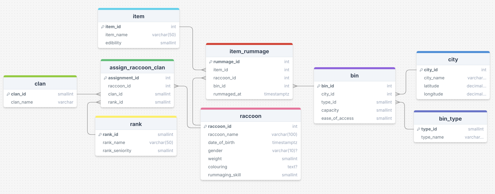

# Trash Pandas DB
- A raccoon-themed database for learning SQL queries.


## Setup
**Prerequisites**
- `psql` installed on your device
- `python` installed on your device

**Steps**
1. Run `git clone https://github.com/Leon-JS02/TrashPandas`
2. Enter the repository and create a `.env` file with the following data:
```bash
DB_NAME=trash_pandas
DB_HOST=localhost
DB_PORT=5432
DB_USER=<XXXXXX>
DB_PASSWORD=<XXXXXX>
```
3. Enter the repository and run `bash setup-db.sh`

## ERD

